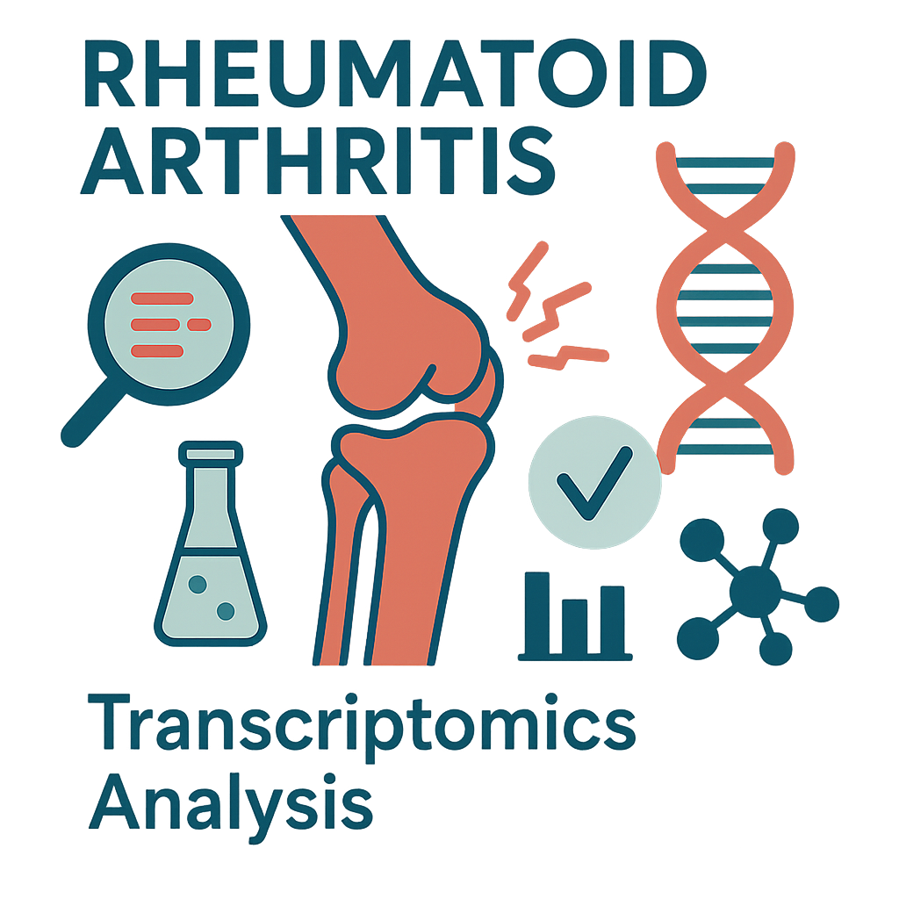

# Verhoogde genactiviteit van Th1-gerelateerde genen bij reumatoïde artritis

  

## 📁 Inhoud/structuur

- `data/raw/` – bevat originele ruwe data zoals verkregen van de bron.   
- `data/processed` - verwerkte datasets gegenereerd met scripts.
- `scripts/` – scripts voor het verwerken van data van transcriptomics-analyses bij reumatoïde artritis (RA).
- `resultaten/` - uitvoer van analyses, zoals grafieken, plots en tabellen. 
- `literatuur/` - gebruikte referenties en literatuur voor het onderzoek.  
- `README.md` - het document om de tekst hier te genereren.
- `assets/` - overige documenten voor de opmaak van deze pagina.
- `data_stewardship/` - in deze folder is de uitwerking van de competentie beheren te vinden.

---

## 📖 Introductie

Reumatoïde artritis (RA) is een chronische auto-immuunziekte die voornamelijk de kleine gewrichten aantast, zoals die in de handen, voeten, knieën en polsen. De ziekte wordt gekarakteriseerd door ontsteking van het synoviale weefsel (Hall et al., 2024). Chronische en herhaalde ontstekingen van de synoviale gewrichten kunnen leiden tot vervorming en vernietiging van kraakbeen en bot, wat uiteindelijk kan resulteren in invaliditeit bij patiënten (Li et al., 2014).
Hoewel er effectieve therapieën beschikbaar zijn die de toestand van RA-patiënten kunnen verbeteren, is er momenteel geen genezing voor de ziekte (S El-Gabalawy, 2002). De ziektemechanismen van RA zijn gedeeltelijk bekend, maar de genregulatie blijft complex. Transcriptomics en meta-analyses spelen een belangrijke rol in het identificeren van genen die mogelijk bijdragen aan een vroegere diagnose en betere behandelingsopties (Afroz et al., 2017).
Dit onderzoek heeft als doel om met behulp van R transcriptomicsdata te analyseren en te identificeren welke genen differentieel tot expressie komen bij reumatoïde artritis (RA) in vergelijking met een controlegroep. Daarnaast wordt onderzocht welke biologische pathways betrokken zijn bij de ziekte via Gene Ontology analyse. Hierbij is ingezoomd op de Th1- en Th2-celdifferentiatiepathway, met als vraag welke rol deze pathway speelt bij reumatoïde artritis.

De literatuur die hierbij is geraadpleegd, is beschikbaar in de [bronnenmap](literatuur)

## 📈 Methoden

Voor dit onderzoek zijn synoviumbiopten (gewrichtsslijnvlies) gebruikt van 8 personen: 4 met reumatoïde artritis (RA) en 4 zonder RA. De RA-patiënten hadden een bevestigde diagnose van >12 maanden en testten positief op ACPA. De controlepersonen waren ACPA-negatief. De data is afkomstig uit een eerder gepubliceerd onderzoek van Platzer et al. (2019).

De voorbereiding en voorbewerking van de ruwe reumatoïde artritis data werden uitgevoerd in [Scripts/Mapping.R](Scripts/Mapping.R) Hierbij is het humane genoom (NCBI RefSeq: GCF_000001405.40) gebruikt als referentie. Vervolgens is op basis van BAM-bestanden een count matrix gegenereerd met [Scripts/Count_Matrix.R](Scripts/Count_Matrix.R) waarbij het referentiegenoom met accession number GCF_000001405.25-RS_2024_09 gebruikt is. Tot slot zijn op de gegenereerde count matrix statistische analyses uitgevoerd, waaronder een differentiële genexpressie analyse waaronder DESeq2 en een GO-Seq analyse, zoals beschreven in [Scripts/Statistiek_en_Analyse.R](Scripts/Statistiek_en_Analyse.R). Hierin is ook aan de hand van KEGG-pathway [hsa04658](https://www.kegg.jp/pathway/hsa04658) gekeken naar Th1- en Th2-celldifferentiatie. 

Dit alles is samengevat in een [flowschema](Resultaten/Flowschema_Scripts.png).

## 📊 Resultaten

Om inzicht te krijgen in de biologische processen die betrokken zijn bij reumatoïde artritis (RA), werd een [GO-Seq analyse](Resultaten/GO_plot.png) uitgevoerd op de genen die significant verschillend tot expressie kwamen tussen RA-patiënten en controles. Uit de analyse kwamen diverse immuun-gerelateerde processen naar voren als significant verrijkt, zoals T-helpercel differentiatie, signaaltransductie en de adaptieve immuunrespons. Dit wijst op afwijkingen in immuunactiviteit bij RA en vormde een basis voor verdere verdieping in een specifieke signaalroute.

De [Probability Weighting Function](Resultaten/pwf_plot.png) (PWF) corrigeert voor bias veroorzaakt door verschillen in genlengte, waardoor de resultaten van de GO-Seq analyse betrouwbaarder worden.Hierdoor worden de genen niet onterecht als significant bescouwd op basis van hun lengte. 

Vervolgens werd op basis van deze resultaten ingezoomd op een specifieke [KEGG-pathway](Resultaten/hsa04658.pathview.png), namelijk Th1 and Th2 cell differentiation (hsa04658). In deze pathway vertoonden meerdere genen verhoogde expressie, waaronder STAT1, STAT4, T-bet en INF-y, die geassocieerd zijn met Th1-celactivatie.

Tot slot is de differentiële genexpressie visueel weergegeven in een [volcano plot](Resultaten/VolcanoplotWC.png). De rood gekleurde genen geven zowel een significante verandering in expressie weer (p-waarde <0,05) en een grote mate van up- of downregulated aan. De groen gekleurde genen hebben een expressieverandering, maar zonder statistische significantie. Er zijn 2058 genen significant omhoog gereguleerd en 2487 significant omlaag gereguleerd. 

## 💡 Conclusie

Uit de analyse van de RA-transcriptomicsdata bleek dat vooral genen actief zijn die betrokken zijn bij het imuunsysteem, voornamelijk de genen die een rol spelen bij T-helpercellen. Deze zijn significant verhoogd tot expressie gekomen bij RA-patiënten vergeleken met controles. 

In de Th1 and Th2 cell differentiation pathway kwamen meerdere genen naar voren met hogere activiteit, zoals STAT1, STAT4, T-bet en INF-γ. Deze genen sturen de activatie van Th1-cellen aan, die betrokken zijn bij ontstekingsreacties. De verhoogde activiteit van deze genen past bij het ontstekingsbeeld van reumatoïde artritis. 

